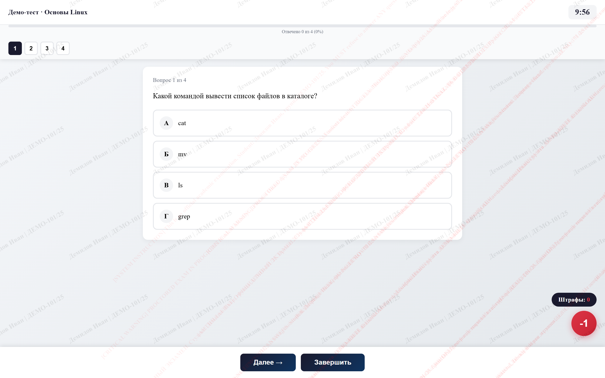
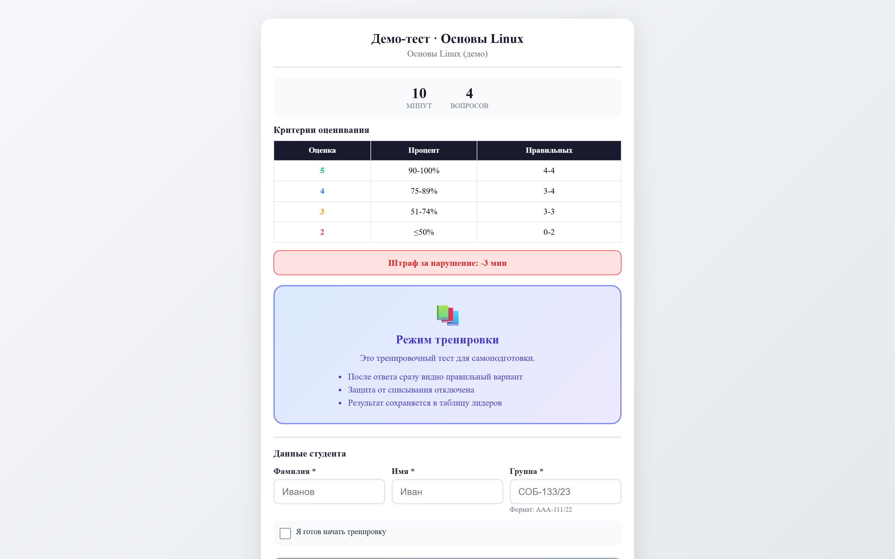
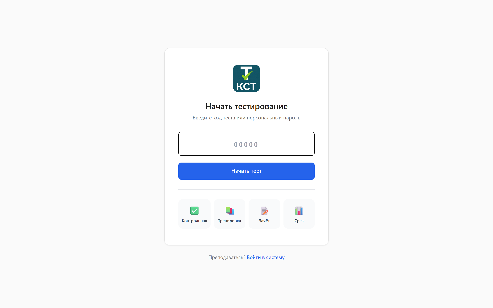
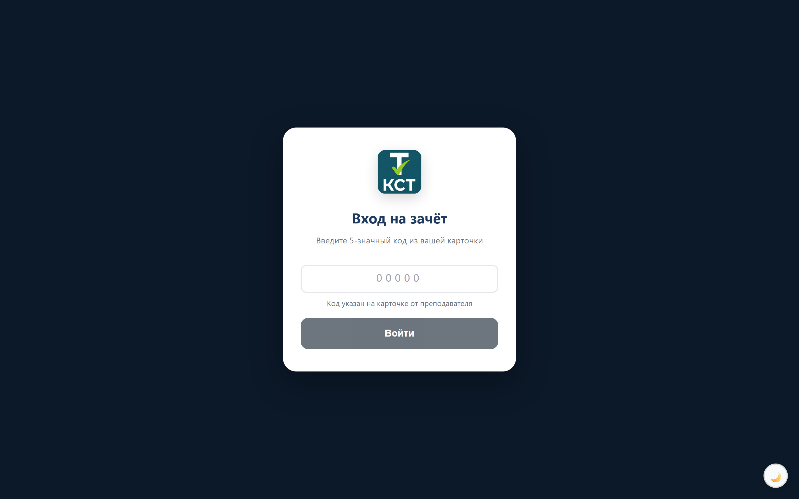
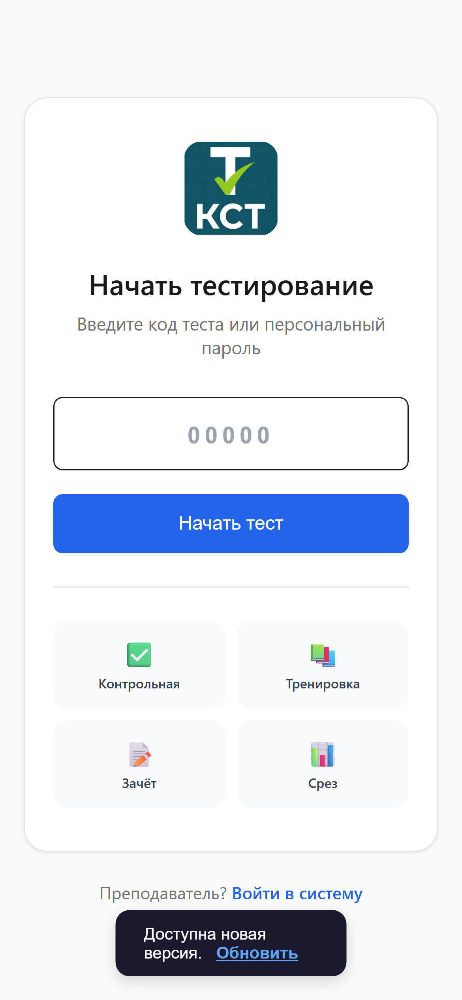

<div align="center">

# 🎓 KST Test

**Open-source online testing & examination platform for vocational education**
**Открытая платформа онлайн-тестирования и экзаменов для СПО**

[](https://kst-test.ru)
[](https://nodejs.org)
[](https://www.postgresql.org)
[](./LICENSE)
[](#contributing)

**[🌐 Live demo](https://kst-test.ru)** · [Features](#features) · [Quick start](#quick-start) · [Architecture](#architecture)

</div>

---

## 📸 Screenshots

<div align="center">
  
  <br/><sub><b>Taking a test</b> — single/multiple choice, live timer, question navigator, progress bar and per-student anti-cheat watermark</sub>
</div>

<br/>

<table>
  <tr>
    <td width="50%"><br/><sub><b>Before the test</b> — grading scale, time limit, mode info and student details form</sub></td>
    <td width="50%"><br/><sub><b>Student entry</b> — enter a test code; pick Quiz / Practice / Exam / Knowledge-check</sub></td>
  </tr>
  <tr>
    <td width="50%"><br/><sub><b>Exam mode</b> — focused dark UI, 5-digit access code from the teacher's card</sub></td>
    <td width="50%" align="center"><br/><sub><b>Mobile</b> — fully responsive for phones in the classroom</sub></td>
  </tr>
</table>

> 🌐 Try it live: **[kst-test.ru](https://kst-test.ru)**

---

## English

KST Test is a self-hostable web platform for running online quizzes, exams and
knowledge checks in vocational colleges and schools. It is used in real
coursework: students take server-graded tests, teachers manage question banks
and monitor live exam sessions from an admin panel, and the app keeps working
through an **offline mode** when classroom networks drop.

It gives education providers a free alternative to paid LMS exam tools, with no
vendor lock-in — everything runs on Node.js + PostgreSQL on your own server.

### Features

- 📝 **Tests, exams & knowledge checks** — three assessment modes (`test.html`, `exam.html`, `srez.html`)
- 🧑‍🏫 **Admin panel** — question banks, groups, disciplines, results, live monitoring (`admin.html`)
- 🛡️ **Server-side grading** — answers are validated on the server, not in the browser
- 📶 **Offline-first** — Service Worker + IndexedDB cache survive flaky classroom Wi-Fi
- 📊 **Results & analytics** — per-student and per-group reporting, export
- ⚡ **Production-ready** — PM2 cluster (4 workers), `helmet`, `compression`, graceful shutdown

### Adoption

The platform has been used in production by **~1,000 students** taking real tests
and exams at a vocational college. It was developed and rolled out locally
inside the institution first — hence few GitHub stars so far — and is now being
open-sourced so other education providers can self-host it.

### Quick start

```bash
git clone https://github.com/ngpless/kst-test.git
cd kst-test
npm install

cp .env.example .env          # set DB credentials and admin password
psql -U <user> -d <db> -f init-db.sql

npm start                     # dev
npm run pm2                   # production (PM2 cluster)
```

### Architecture

| File / dir            | Purpose                                       |
|-----------------------|-----------------------------------------------|
| `server-postgres.js`  | Main server — REST API + page serving         |
| `index.html`          | Entry / landing                               |
| `start.html`          | Test start screen                             |
| `test.html`           | Test runner                                   |
| `exam.html`           | Proctored exam mode                           |
| `srez.html`           | Knowledge-check mode                          |
| `admin.html` + `js/admin/` | Admin panel (modular client scripts)     |
| `js/offline-db.js`    | Offline IndexedDB layer                       |
| `sw.js`               | Service Worker (offline cache)                |
| `init-db.sql`         | Database schema                               |
| `ecosystem.config.js` | PM2 cluster configuration                     |

**Stack:** Node.js (≥14), `pg`, `helmet`, `compression`, `dotenv`, PostgreSQL, PM2.

### Configuration

All secrets live in `.env` (never committed — see `.env.example`):
database connection, server port, allowed origin (CORS), admin credentials.

### Contributing

Contributions are welcome — open an issue or a pull request. Please don't
commit a real `.env`; use `.env.example` as the template.

### License

[MIT](./LICENSE) © 2026 ngpless

---

## Русский

**KST Test** — открытая платформа онлайн-тестирования для учреждений СПО:
тесты, экзамены и срезы знаний с серверной проверкой ответов, админ-панелью и
офлайн-режимом для нестабильного интернета в учебных аудиториях. Применяется в
реальном учебном процессе (Node.js + PostgreSQL, кластер PM2). Это бесплатная,
самостоятельно разворачиваемая альтернатива платным экзаменационным LMS.

### Возможности

- 📝 Три режима оценивания: тест, экзамен, срез знаний
- 🧑‍🏫 Админ-панель: банки вопросов, группы, дисциплины, результаты, онлайн-мониторинг экзамена
- 🛡️ Серверная проверка ответов (защита от подмены в браузере)
- 📶 Офлайн-режим (Service Worker + IndexedDB) для слабого Wi-Fi
- 📊 Аналитика и выгрузка результатов
- ⚡ Production-готовность: PM2-кластер (4 воркера), helmet, сжатие, graceful shutdown

### Применение

Через систему уже прошло **около 1000 студентов** — реальные тесты и экзамены в
колледже. Платформа сначала развивалась и внедрялась локально внутри учреждения
(поэтому звёзд на GitHub пока мало), а теперь открывается, чтобы её могли
развернуть у себя другие образовательные организации.

### Установка

```bash
git clone https://github.com/ngpless/kst-test.git
cd kst-test
npm install
cp .env.example .env          # укажите доступ к БД и пароль администратора
psql -U <user> -d <db> -f init-db.sql
npm start                     # запуск
npm run pm2                   # production под PM2
```

🌐 **Живое демо: [kst-test.ru](https://kst-test.ru)**

### Лицензия

[MIT](./LICENSE) © 2026 ngpless
